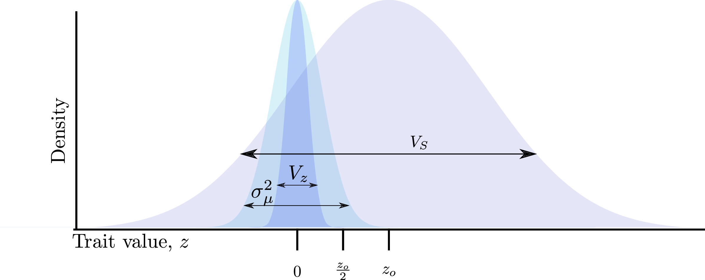

---
output:
  bookdown::pdf_document2:
    latex_engine: xelatex
    toc: no
    number_sections: false
    keep_tex: true
    includes:
      in_header: "preamble.tex"
bibliography: "references.bib"
abstract: The abtract (but it could also be a normal section).
title: "Paper title"
author:
  - Author 1^[Institution 1, email1]
  - Author 2^[Institution 2, email2]
---


```{r setup, echo=FALSE}
```

# Introduction

This paper is neat [@Ragsdale2020-hv].

@Ragsdale2020-hv is still a neat paper if we cite it like this.

```{r figure, echo=F, fig.cap="A figure", fig.align="center", out.width="50%"}

```

See Figure \@ref(fig:figure).


\clearpage
\newpage

# Supporting Information

\renewcommand{\thefigure}{S\arabic{figure}}
\renewcommand{\thetable}{S\arabic{table}}
\setcounter{figure}{0}
\setcounter{table}{0}

```{r sfigure, echo=F, fig.cap="A figure", fig.align="center", out.width="50%"}

```

See Supplementary Figure \@ref(fig:figure).

\clearpage
\newpage

# References
